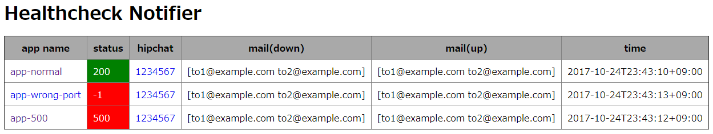

# Healthcheck Notifier

'Healthcheck Notifier' is a simple healthchecker and notifier for web application.

If this gets healthcheck error of target applications, this notifies to hipchat and sends mails to specified mail addresses.

## Quick Start

### Download

Download the latest executable binary(Windows, macOS and Linux) from [the releases page](https://github.com/chibat/healthcheck-notifier/releases).

### Run

Execute following command(In the case of Linux).  
```
$ ./healthcheck-notifier-linux-amd64
```

### Display the monitor view

Open http://localhost:18888/ in web browser.

screenshot  


## Configuration

'Healthcheck Notifier' generates the configuration file(config.json) in first start up.

```json
{
    "cron": "*/10 * * * * *",
    "port": 18888,
    "hipchat-proxy": "",
    "hipchat-subdomain": "hipchat-subdomain",
    "smtp-server": "localhost:25",
    "mail-address-from": "from@example.com",
    "apps": [
        {
            "name": "self",
            "url": "http://localhost:18888/",
            "proxy": "",
            "hipchat-room": "1234567",
            "hipchat-token": "",
            "mail-address-to-down": ["to1@example.com", "to2@example.com"],
            "mail-address-to-up": ["to1@example.com", "to2@example.com"]
        }
    ]
}
```

* cron: scheduled string by cron format
* port: HTTP port for monitor web view
* hipchat-proxy: proxy URL for HipChat requesting
* hipchat-subdomain: sub domain of your HipChat
* stmp-server: SMTP Server host and port for mail notification
* mail-address-from: 'FROM' mail address for mail notification
* apps[].name: target application name
* apps[].url: target application URL
* apps[].proxy: proxy URL for healthcheck
* apps[].hipchat-room: HipChat room ID for notification
* apps[].hipchat-token: HipChat token for notification
* apps[].mail-address-to-down: notification mail address when application down
* apps[].mail-address-to-up: notification mail address when application up

## Specification

* If HipChat settings is blank, does not notify by HipChat.
* If Mail settings is blank, does not notify by Mail.
* If this gets healthcheck error of target applications, notifies. If this continues to get an error, does not notify.
* If this gets healthcheck success after healthcheck error, notifies.

